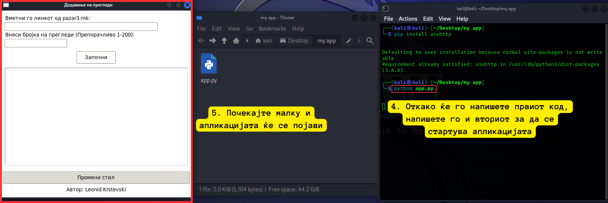

# Додавање на прегледи

## Опис

Овој проект е направен за додавање на прегледи на сајтот pazar3.mk
Програмата овозможува внесување на URL на огласот и број на прегледи кои сакате да се додадат. По стартување, програмата ќе изврши додавање на прегледи на внесениот URL користејќи асинхронно програмирање.

## Чекори за извршување
Преземете го кодот: Преземете го кодот од репозиториумот.

## Инсталирајте ги библиотеките: Отворете терминал или командна линија и инсталирајте ги потребните библиотеки со следната команда:
pip install aiohttp

## Извршете го кодот: Отворете терминал или командна линија и пишете ја Python скриптата со следната команда:
python app.py

### Користење на апликацијата: Следете ги упатствата за користење на апликацијата.

## Упатство за користење

1. Внесете го URL линкот на веб страницата на која сакате да додадете прегледи во полето за внесување на URL линк.
2. Внесете го бројот на прегледи кои сакате да додадете во полето за внесување на број на прегледи. Препорачливо е да внесете број помеѓу 1 и 200.
3. Кликнете на копчето "Започни" за да започнете со додавање на прегледи.
4. За да го промените стилот на апликацијата од светло на темно и обратно, кликнете на копчето "Промени стил".

## Опомена

Овој проект не е наменет за било какви сајбер нарушувања или незаконски цели. Авторот не носи одговорност за било каква злоупотреба на овој код.

## Автор

Автор на овој проект е Леонид Крстевски.
